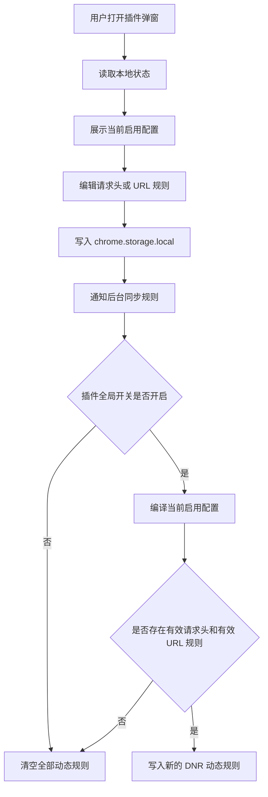

# Chrome 请求头插件 PRD

## 1. 产品概述

这是一个可本地加载到 Chrome 的 Manifest V3 浏览器插件，用于在弹窗内集中管理请求头修改配置，并按 URL 规则决定何时生效。

- 面向需要在开发、联调、调试接口时临时修改请求头的前端、后端、测试与产品同学
- 目标是在保留 ModHeader 核心使用体验的前提下，交付一个更聚焦、更轻量、更易维护的 MVP

## 2. 核心功能

### 2.1 用户角色

本期无复杂角色区分，默认仅有插件使用者一种角色。

| 角色 | 使用方式 | 核心权限 |
|------|----------|----------|
| 插件使用者 | 本地加载插件 | 管理配置、编辑请求头、编辑 URL 规则、启停插件 |

### 2.2 功能模块

1. **弹窗主页面**：顶部全局开关、当前配置标题、左右分栏编辑区域
2. **配置列表模块**：新增配置、切换配置、删除配置、激活态展示
3. **请求头编辑模块**：新增、编辑、启停、删除请求头条目
4. **URL 规则编辑模块**：新增、编辑、启停、删除过滤规则，并提示正则错误

### 2.3 页面明细

| 页面名称 | 模块名称 | 功能描述 |
|-----------|-----------|-----------|
| 弹窗主页面 | 顶部工具栏 | 控制插件全局启用状态，显示当前启用配置名称及生效状态 |
| 弹窗主页面 | 左侧配置列表 | 展示全部配置，支持新增、切换与删除，且同一时间仅一个配置生效 |
| 弹窗主页面 | 请求头编辑区 | 以可编辑表格方式维护请求头名称、值和启停状态 |
| 弹窗主页面 | URL 规则编辑区 | 以可编辑列表方式维护正则规则、启停状态和合法性提示 |

## 3. 核心流程

用户首次加载插件后，系统创建一个默认配置。用户可在弹窗中新增多个配置，但任意时刻仅一个配置为启用配置。用户在右侧编辑当前配置的请求头与 URL 规则，保存后立即写入本地存储，并通知后台重新编译 DNR 动态规则。若全局开关关闭，则所有规则被清空；若全局开关开启，则按当前启用配置的有效请求头与有效 URL 规则重新生成动态规则。

## 4. 用户界面设计

### 4.1 设计风格

- 主色：深色中性底色配合蓝色强调色
- 按钮风格：圆角、轻描边、弱阴影、悬浮反馈清晰
- 字体与字号：系统中文字体栈，层级克制，强调信息密度与可读性
- 布局风格：桌面优先的双栏信息工作台，左窄右宽，上下分区明确
- 图标风格：简洁线性图标，减少冗余说明文字

### 4.2 页面设计概览

| 页面名称 | 模块名称 | UI 元素 |
|-----------|-----------|-----------|
| 弹窗主页面 | 顶部工具栏 | 全局开关、当前配置名称、状态提示、简洁分隔结构 |
| 弹窗主页面 | 左侧配置列表 | 紧凑列表项、选中态高亮、图标化新增与删除按钮 |
| 弹窗主页面 | 请求头编辑区 | 表格式输入行、启用开关、删除按钮、空状态提示 |
| 弹窗主页面 | URL 规则编辑区 | 列表式输入行、正则校验提示、启用开关、删除按钮 |

### 4.3 响应式策略

- 采用桌面优先设计，针对 Chrome 扩展弹窗尺寸优化
- 目标尺寸约为 `720px * 560px`
- 不追求移动端适配，但保证内容在较小高度下可滚动

## 5. 范围与边界

- 仅支持修改请求头，不支持响应头
- 不提供独立 options 页面
- 不支持导入导出配置
- 不支持跨设备同步，仅使用 `chrome.storage.local`
- 不提供“添加当前 URL”快捷能力
- 不提供配置重命名以外的复杂管理能力，本期默认使用简单命名规则

## 6. 成功标准

- 插件可通过 Chrome `Load unpacked` 成功加载
- 弹窗可完整展示顶部、左侧配置列表与右侧上下编辑区
- 用户可新增、切换、删除配置
- 用户可新增、编辑、删除请求头与 URL 过滤规则
- 停用插件时不注入任何请求头
- 命中规则时能成功写入请求头
- 切换启用配置后，新配置立即生效且旧规则失效
