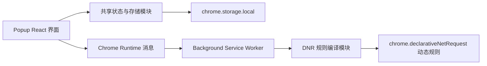

# Chrome 请求头插件技术架构文档

## 1. 架构设计



## 2. 技术说明

- 插件规范：Chrome Extension Manifest V3
- 前端：React 最新稳定版 + TypeScript 最新稳定版 + Vite 最新稳定版
- 样式：Tailwind CSS 最新稳定版 + 少量全局样式
- 包管理器：pnpm
- 代码规范：ESLint + Prettier
- 状态管理：React 原生状态与派生计算，不引入额外状态库
- 数据持久化：`chrome.storage.local`
- 请求头修改能力：`chrome.declarativeNetRequest.updateDynamicRules`
- 后台脚本：Service Worker

## 3. 路由定义

本项目不使用多页面路由系统，仅包含一个弹窗页面入口。

| 路由 | 用途 |
|------|------|
| `popup.html` | 插件弹窗页面入口 |

## 4. 模块划分

| 模块 | 职责 |
|------|------|
| `src/popup` | React 弹窗入口、页面骨架与交互逻辑 |
| `src/popup/components` | 视图组件，如侧边栏、编辑器、卡片容器等 |
| `src/shared/types.ts` | 插件状态、配置项、消息体等共享类型定义 |
| `src/shared/defaults.ts` | 默认状态与默认配置生成逻辑 |
| `src/shared/storage.ts` | `chrome.storage.local` 读写封装 |
| `src/shared/dnr.ts` | 当前启用配置到 DNR 规则的编译逻辑 |
| `src/shared/messages.ts` | Popup 与 Background 之间的消息类型与常量 |
| `src/background/service-worker.ts` | 初始化同步、消息监听、动态规则更新 |

## 5. 数据模型

### 5.1 类型定义

```ts
export type HeaderItem = {
  id: string;
  key: string;
  value: string;
  enabled: boolean;
};

export type UrlFilterItem = {
  id: string;
  pattern: string;
  enabled: boolean;
};

export type Profile = {
  id: string;
  name: string;
  headers: HeaderItem[];
  urlFilters: UrlFilterItem[];
};

export type ExtensionState = {
  extensionEnabled: boolean;
  profiles: Profile[];
  activeProfileId: string | null;
};
```

### 5.2 数据存储结构

- 使用单一键值保存完整插件状态
- 所有弹窗编辑操作先更新本地内存状态，再写入 `chrome.storage.local`
- 写入成功后通过消息通知后台同步规则

## 6. 动态规则编译策略

- 仅在 `extensionEnabled === true` 时生成动态规则
- 仅根据 `activeProfileId` 对应的当前启用配置生成规则
- 一个有效的 URL 过滤条目编译为一条 DNR 规则
- 每条规则中合并当前配置下所有有效请求头
- 仅编译 `enabled === true` 且内容非空的请求头与 URL 规则
- 同名请求头只保留最后一条启用项
- 若没有有效请求头或没有有效 URL 规则，则清空动态规则
- 非法正则在 UI 中提示，并从编译结果中排除

## 7. Manifest 设计

需要声明以下核心能力：

- `manifest_version: 3`
- `action.default_popup`
- `background.service_worker`
- 权限：`storage`、`declarativeNetRequest`
- Host 权限：用于请求头修改能力生效的全局匹配

## 8. 构建与产物策略

- 使用 Vite 进行项目构建
- 输出产物包含：
  - `popup.html`
  - popup 前端静态资源
  - `manifest.json`
  - `background/service-worker.js`
  - 图标资源
- `manifest.json` 放在 `public/`，由构建时原样拷贝

## 9. 校验策略

- 使用 `pnpm lint` 进行 ESLint 校验
- 使用 `pnpm exec tsc --noEmit` 进行类型检查
- 不默认执行完整生产构建

## 10. 风险与处理

| 风险 | 影响 | 处理方式 |
|------|------|----------|
| 正则表达式非法 | 规则无法下发 | 在 UI 即时校验并提示，不参与编译 |
| 当前启用配置被删除 | 生效规则丢失 | 自动切换到剩余第一个配置，无配置时清空规则 |
| 同名请求头重复 | 生效结果不确定 | 编译时仅保留最后一条启用项 |
| 全局开关关闭后仍残留旧规则 | 产生误注入 | 后台统一在停用时主动清空全部动态规则 |
